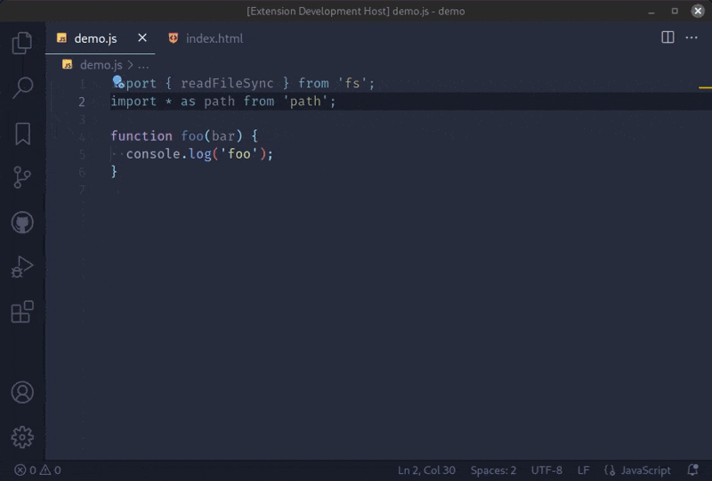
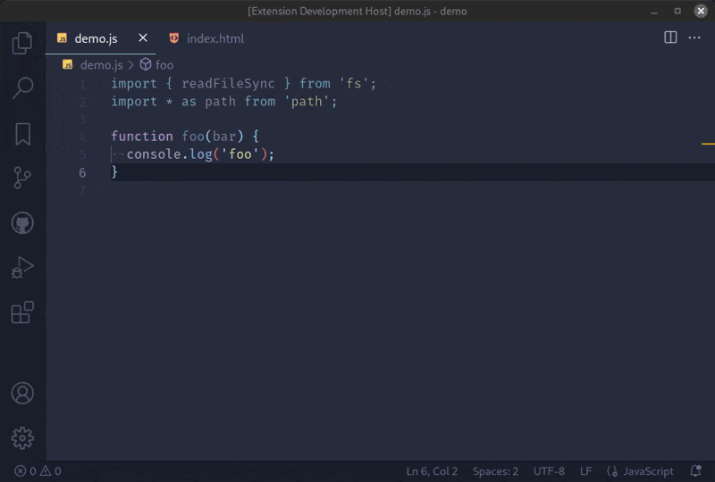

# Autocomplete Line

Auto complete lines by grepping the project.
Inspired by [eacl](https://github.com/redguardtoo/eacl) package for Emacs.

## Requirements

- ripgrep: `rg`

## Features

- The `Autocomplete Line` command completes single line by grepping the project root.
   The keyword to grep is the text from the line beginning to current cursor.

  

- The `Autocomplete Multiline` command completes multiline code or html tag.
   It's a tricky one, but the overall behaviour is quite stupid:
  for each single line candidate it looks for the next line with the same indentation.
   So, it *should* work for autocompletion of c-like functions, html tags, css rules and so on.

  

According to the `ripgrep` defaults, both commands will respect your `.gitignore` and skip hidden
files/directories and binary files from the search.
